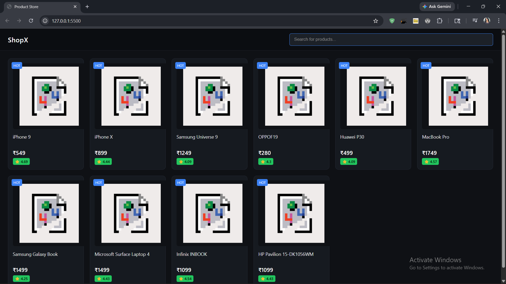

# 🛍️ Product Listing UI (Dark Theme)

A clean and modern product listing interface built using HTML, CSS, and JavaScript.

## 🔗 Live Demo

(https://product-listing-ui-one.vercel.app/)

---

## 🚀 Features

* Fetch products from public API
* Responsive grid layout
* Premium dark theme UI
* Real-time search functionality
* Product cards with price, rating, and badge

---

## 🧠 Tech Stack

* HTML
* CSS (Dark UI Styling)
* Vanilla JavaScript (Fetch API)

---

## 📡 API Used

https://api.freeapi.app/api/v1/public/randomproducts

---

## 📸 Preview

---

## ⚙️ Run Locally

1. Clone the repo
2. Open `index.html` in browser
   OR use Live Server

---

## ✨ Future Improvements

* Add to Cart
* Wishlist
* Product detail page
* Skeleton loading UI

---

## 👨‍💻 Built by

Tanishka Rathi
