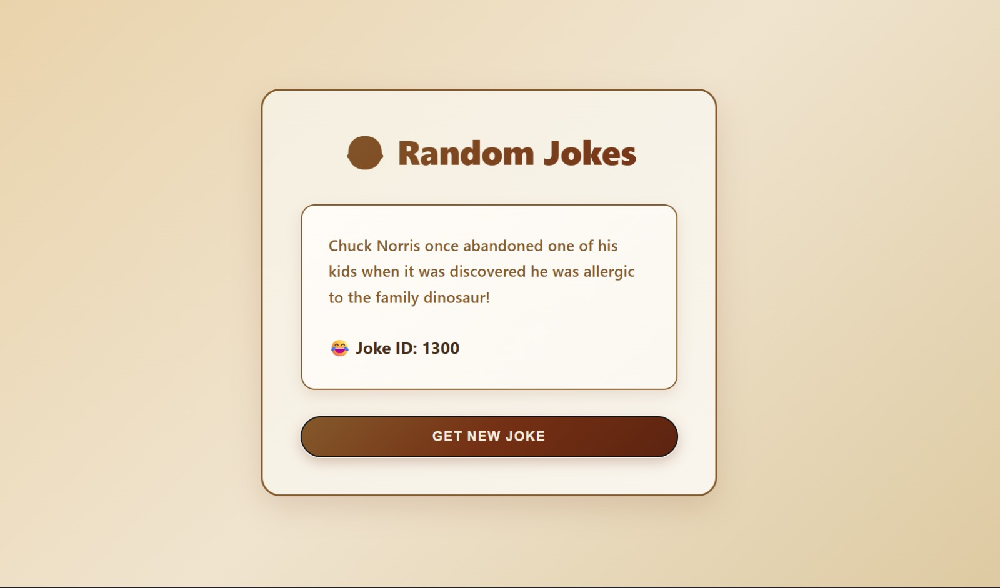

# 😂 Random Jokes Viewer

A fun and interactive jokes viewer application built using the Random Jokes API.  
This project fetches random jokes dynamically and displays them in a clean modern UI.

---

## 🚀 Live Demo

🔗 https://jokes-viewer-application-ashen.vercel.app

---

## 📸 Preview



---

## ✨ Features

- Random joke generator
- Responsive dark premium UI
- Fetch API integration
- Loading & error handling
- Simple and clean user experience

---

## 🛠️ Tech Stack

- HTML5
- CSS3
- JavaScript
- Random Jokes API

---

## 📡 API Used

https://api.freeapi.app/api/v1/public/randomjokes
```

---

## ⚙️ Run Locally

```bash
git clone https://github.com/rathitanishka-tech/Jokes-Viewer-Application.git
```

Open `index.html` in your browser.

---

## 👨‍💻 Author

Tanishka Rathi