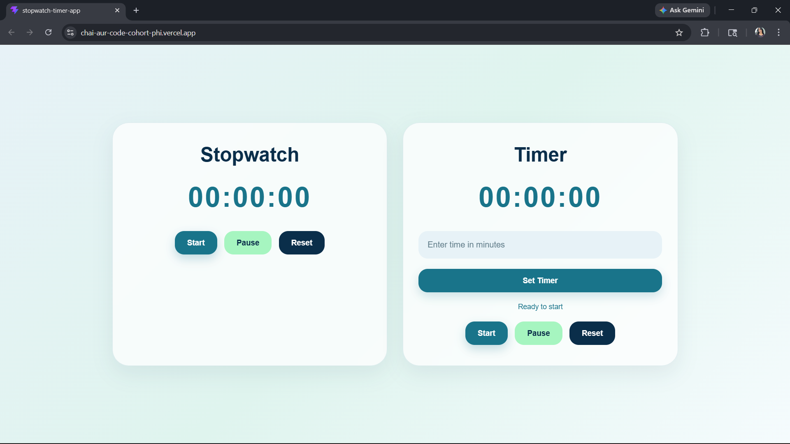

# Stopwatch & Timer App

### Live Demo
🔗 https://chai-aur-code-cohort-phi.vercel.app/

A clean and responsive Stopwatch & Timer application built using React and CSS.

The project focuses on React state management, time handling using hooks, reusable components, and a polished user interface.


## Features

- Stopwatch functionality
  - Start
  - Pause
  - Reset

- Timer functionality
  - Custom time input
  - Start
  - Pause
  - Reset

- Responsive design
- Clean and minimal UI
- Reusable components
- Smooth user interactions

---

## Tech Stack

- React
- JavaScript
- CSS
- Vite

---

## Project Structure

```bash
src
│
├── components
│   ├── Stopwatch.jsx
│   ├── Timer.jsx
│   ├── TimeDisplay.jsx
│   └── styles.css
│
├── App.jsx
├── main.jsx
└── index.css
```

---

## Getting Started

Clone the project

```bash
git clone https://github.com/rathitanishka-tech/Chai-aur-code-cohort.git
```

Go to the project directory

```bash
cd Projects/stopwatch-timer-app
```

Install dependencies

```bash
npm install
```

Start the development server

```bash
npm run dev
```

---

## Learning Highlights

While building this project, I practiced:

- React Hooks (`useState`, `useEffect`)
- Managing intervals and timers
- Component-based architecture
- Responsive CSS layouts
- UI state handling
- Clean folder structure

---

## Screenshots



---

## Future Improvements

- Sound alert when timer ends
- Dark/light mode
- Lap functionality
- Milliseconds support
- Local storage persistence

---

## Author

Made by Tanishka