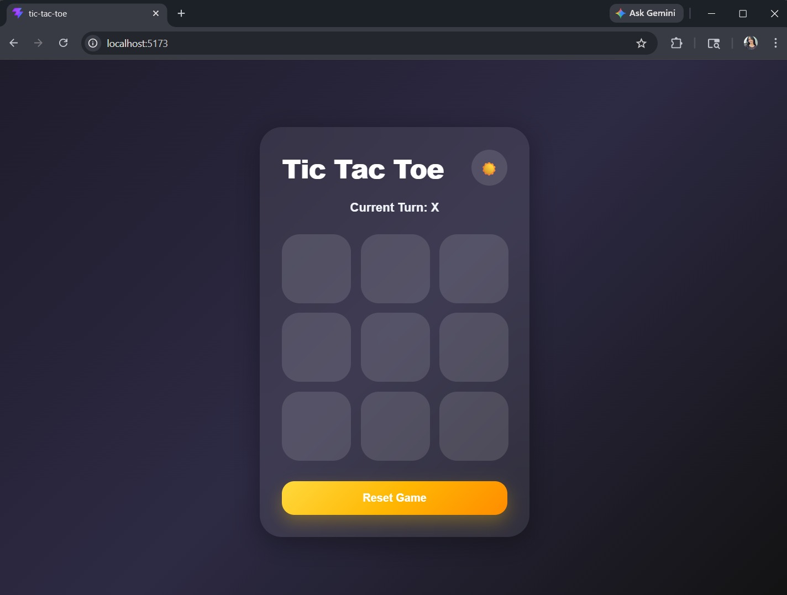

# 🎮 Tic Tac Toe

### Live Demo

🔗 [Click here](https://tic-tac-toe-omega-wine.vercel.app/)

A playful and interactive Tic Tac Toe game built using React and CSS.

This project focuses on React component structure, state management, game logic, and smooth user interaction while maintaining a colorful modern UI.

---

## ✨ Features

* 3x3 interactive game board
* Two-player turn system
* Winner detection
* Draw detection
* Reset game functionality
* Dark / Light theme toggle
* Playful yellow-themed UI
* Smooth hover animations
* Winning tile animations
* Responsive design
* Clean and interactive user experience

---

## 🛠️ Tech Stack

* React
* JavaScript
* CSS3
* Vite

---

## 📂 Project Structure

```bash
src
│
├── App.jsx
├── App.css
├── main.jsx
└── assets
```

---

## 🚀 Getting Started

Clone the project

```bash
git clone https://github.com/rathitanishka-tech/Chai-aur-code-cohort.git
```

Go to the project directory

```bash
cd Projects/tic-tac-toe
```

Install dependencies

```bash
npm install
```

Start the development server

```bash
npm run dev
```

Open in browser

```bash
http://localhost:5173
```

---

## 🧠 Learning Highlights

While building this project, I practiced:

* React Hooks (`useState`, `useEffect`)
* Component-based architecture
* Conditional rendering
* Game logic handling
* Array mapping in React
* Event handling
* CSS animations & transitions
* Responsive UI design
* Theme switching functionality

---

## 🎨 UI Highlights

* Playful yellow color palette
* Smooth interactions
* Glassmorphism inspired design
* Animated winning states
* Modern responsive layout
* Dark / Light mode support

---

## 📸 Preview



---

## 🚀 Future Improvements

* AI opponent mode
* Score tracking system
* Sound effects
* Multiplayer support
* Local storage persistence
* Difficulty levels

---

## 👩‍💻 Author

Made by tanishka
