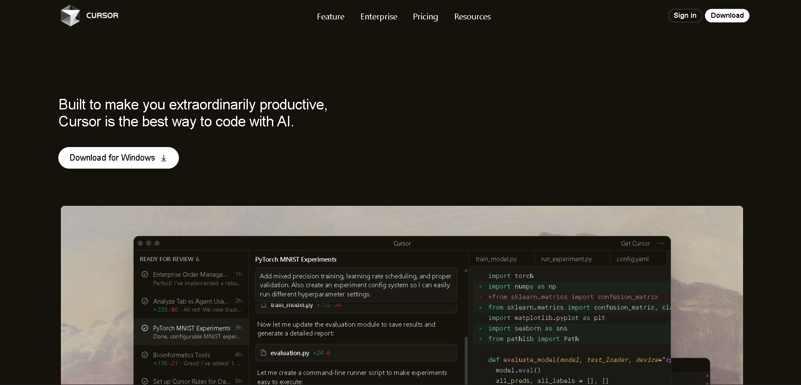
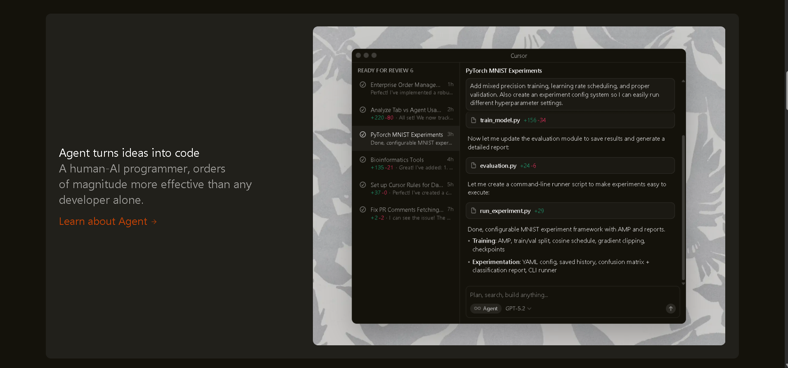
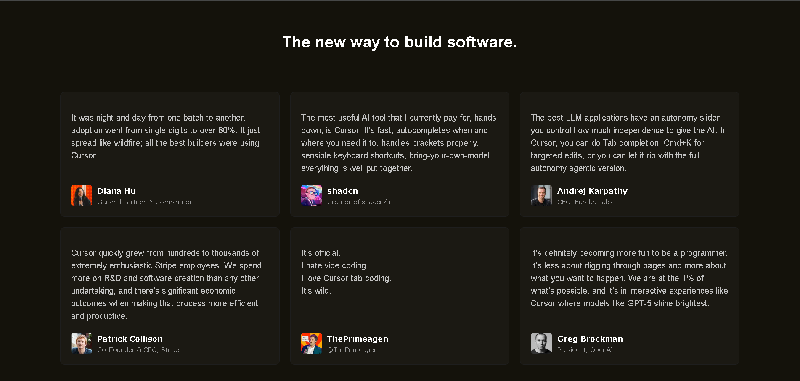
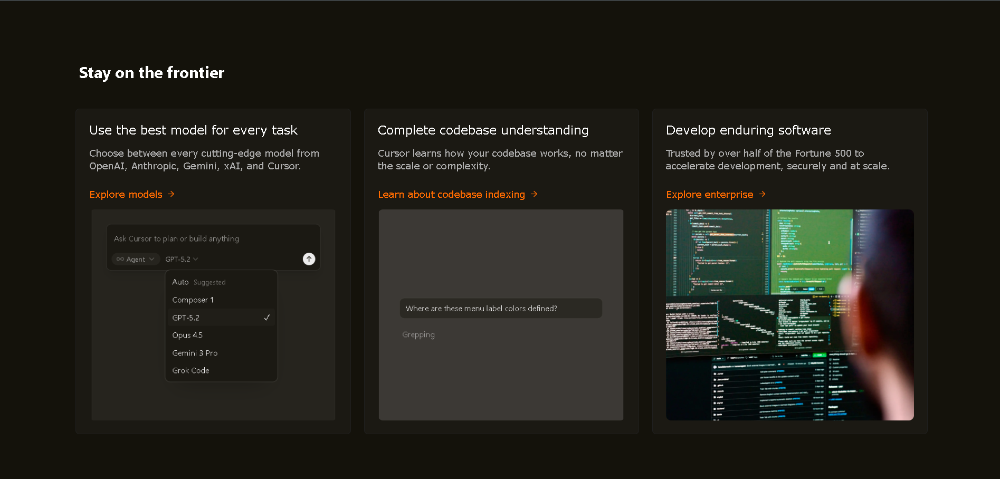
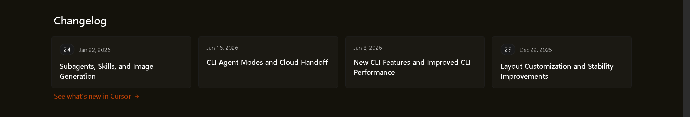
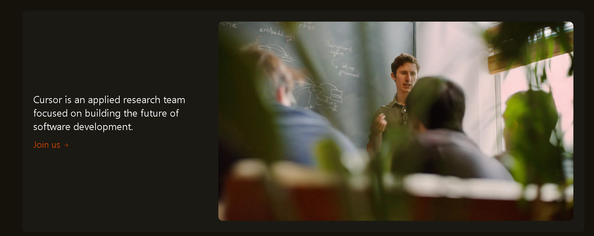
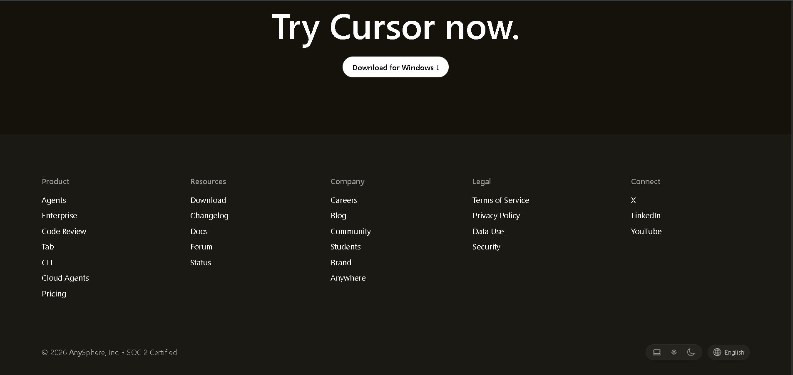

# 🚀 Cursor-Inspired Landing Page — Assignment 2


## 🌐 Live Demo

Vercel:
[(https://chai-aur-code-cohort-pl9k8d0n5-tanishka-rathis-projects.vercel.app)]


## 📸 Screenshots









## 🧩 Sections Recreated

### 🧭 Navigation Bar

* Logo + branding on the left
* Menu items in the center
* “Sign in” and “Download” buttons on the right
* Built using **Flexbox**

### 🚀 Hero Section

* Large headline with strong typography
* “Download for Windows” button with arrow icon
* Centered product screenshot below the hero text

### 🤝 Trusted By Section

* Short trust statement
* Horizontal row of company logos inside styled cards

### 💡 Feature Sections (3 Panels)

Each panel includes:

* Title + description
* “Learn about…” link with arrow icon
* Side-by-side image and text using **Flexbox**

### 🗣️ Testimonials (Cards Grid)

* 3-column layout using **CSS Grid**
* Quote-style text cards
* User profile with avatar, name, and role

### 🌌 “Stay on the Frontier” Section

* Three equal-width cards in a single row
* Each card includes heading, description, link with arrow, and image

### 📝 Changelog Section

* Four changelog cards in a row
* Version badge + date aligned in one line
* “See what’s new in Cursor” link with arrow icon

### 🔬 Research Team Panel

* Text on the left, image on the right
* “Join us” link with arrow icon

### 🎯 Final CTA Section

* Centered heading: **“Try Cursor now.”**
* Rounded download button below

### 📍 Footer

* Five columns: Product, Resources, Company, Legal, Connect
* Bottom bar with copyright text
* Custom **segmented theme control + language pill** UI component

---

## 🖋️ Fonts Used

```
Inter, -apple-system, BlinkMacSystemFont, Segoe UI, sans-serif
```

---

## 🎨 Colors Used

### Backgrounds

* Page: **#14120B**
* Cards / Panels: **#1B1913 / #21201B**

### Text

* Primary: **#FFFFFF**
* Secondary: **#C2C2C2 / #AEAEAE**
* Muted: **#9A9A9A / #BFBFBF**
* Accent links: **#BF4105 / #FF6B00**

### Borders

* Cards: **#1E1E1E / #1f1f1f**
* Pills & badges: **#2a2a2a**

---

## 🛠️ Layout System

* **Flexbox** used for:

  * Navbar
  * Feature panels
  * “Stay on the Frontier” row
  * Changelog row
  * Footer columns

* **CSS Grid** used for:

  * Testimonials section (3 columns)

* Images made responsive using:

```css
img {
  max-width: 100%;
  height: auto;
}
```
---

## 📁 Project Structure

```
assignment2/
│── index.html
|── styles.css
|── assets/
|__ README.md


