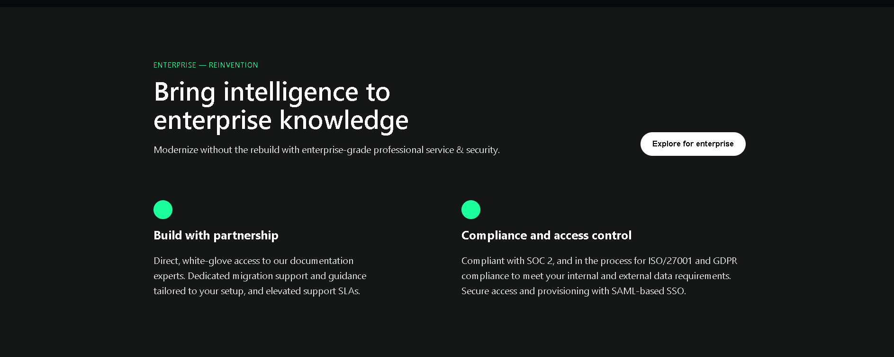
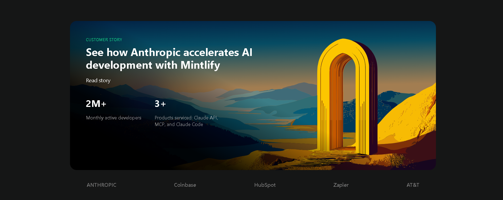

# Mintlify UI Recreation

🔗 **Live on Vercel:**  https://chai-aur-code-cohort-edoc.vercel.app/

---

## 📸 Screenshots (Final Output)

.png)  
  
  
  

---

## 🎯 Sections Recreated
- **Hero Section** – Centered headline + CTA buttons  
- **Customer Story Section** – Full image card with dark overlay + stats  
- **Case Study Cards** – Row of cards with images and “Read story”  
- **Customers Section** – Centered heading and description  
- **Footer** – layout with 5 columns, dividers, status bar

---

## 🎨 Fonts & Colors
**Font:** Inter  

**Key Colors:**
- Background: `#0A0A0A`
- Primary text: `#FFFFFF`
- Secondary text: `#BFC3FF`
- Muted text: `#888888`
- Accent: `#1AFF9B`
- Dividers: `rgba(255,255,255,0.08)`

## 🛠️ Built With
HTML • CSS (Flexbox & Grid) 
