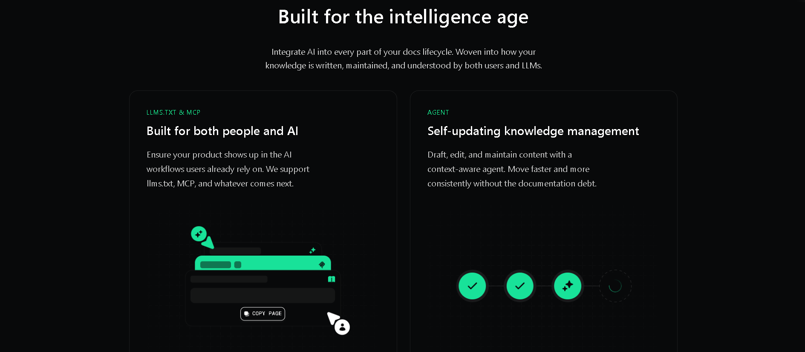
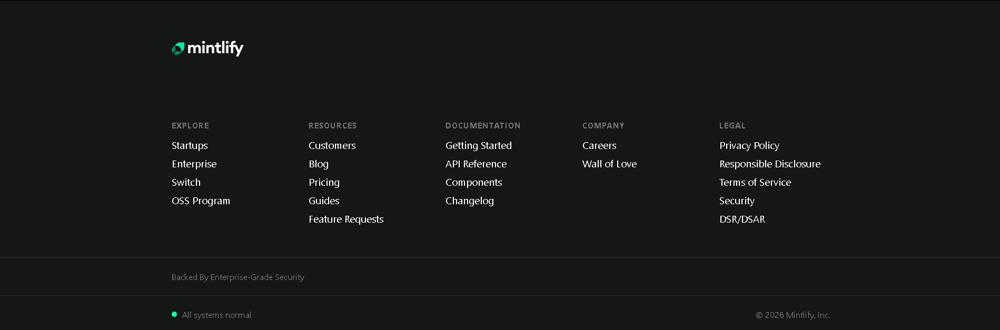

```md
# Mintlify UI Recreation

🔗 **Live on Vercel:** chai-aur-code-cohort-edoc-77q2stny0-tanishka-rathis-projects.vercel.app

---

## 📸 Screenshots (Final Output)

  
  
  
  


---

## 🎯 Sections Recreated
- **Hero Section** – Centered headline + CTA buttons  
- **Customer Story Section** – Full image card with dark overlay + stats  
- **Case Study Cards** – Row of cards with images and “Read story →”  
- **Customers Section** – Centered heading and description  
- **Footer** – Pixel-accurate layout with 5 columns, dividers, status bar

---

## 🎨 Fonts & Colors
**Font:** Inter  

**Key Colors:**
- Background: `#0A0A0A`
- Primary text: `#FFFFFF`
- Secondary text: `#BFC3FF`
- Muted text: `#888888`
- Accent: `#1AFF9B`
- Dividers: `rgba(255,255,255,0.08)`

---

## 🛠️ Built With
HTML • CSS (Flexbox & Grid) • Responsive Design

---

## 🚀 Run Locally
1. Clone repo  
2. Open `index.html` or use Live Server
```
