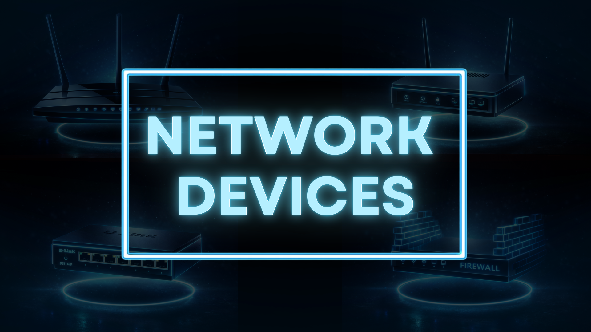

<h1 align="center">Blogs</h1>

### [Network Devices](https://tanishkatech.hashnode.dev/understanding-network-devices)
<a href="https://tanishkatech.hashnode.dev/understanding-network-devices">
  

     

</a>

 

### [TCP vs UDP](https://tanishkatech.hashnode.dev/tcp-vs-udp)

<a href="https://tanishkatech.hashnode.dev/tcp-vs-udp">

     

</a>
 

### [How DNS Resolution Works](https://tanishkatech.hashnode.dev/how-dns-resolution-works)

<a href="https://tanishkatech.hashnode.dev/how-dns-resolution-works">
    

        
    

</a>
 

### [Understanding Git](https://tanishkatech.hashnode.dev/understanding-git)

<a href="https://tanishkatech.hashnode.dev/understanding-git">
    

        
    

</a>

 

### [HTML & Emmet](https://tanishkatech.hashnode.dev/html-and-emmet)

<a href="https://tanishkatech.hashnode.dev/html-and-emmet">
    

        
    

</a>

 

### [cURL]([https://tanishkatech.hashnode.dev/getting-started-with-curl])

<a href="https://tanishkatech.hashnode.dev/getting-started-with-curl">
    

        
    

</a>

 

