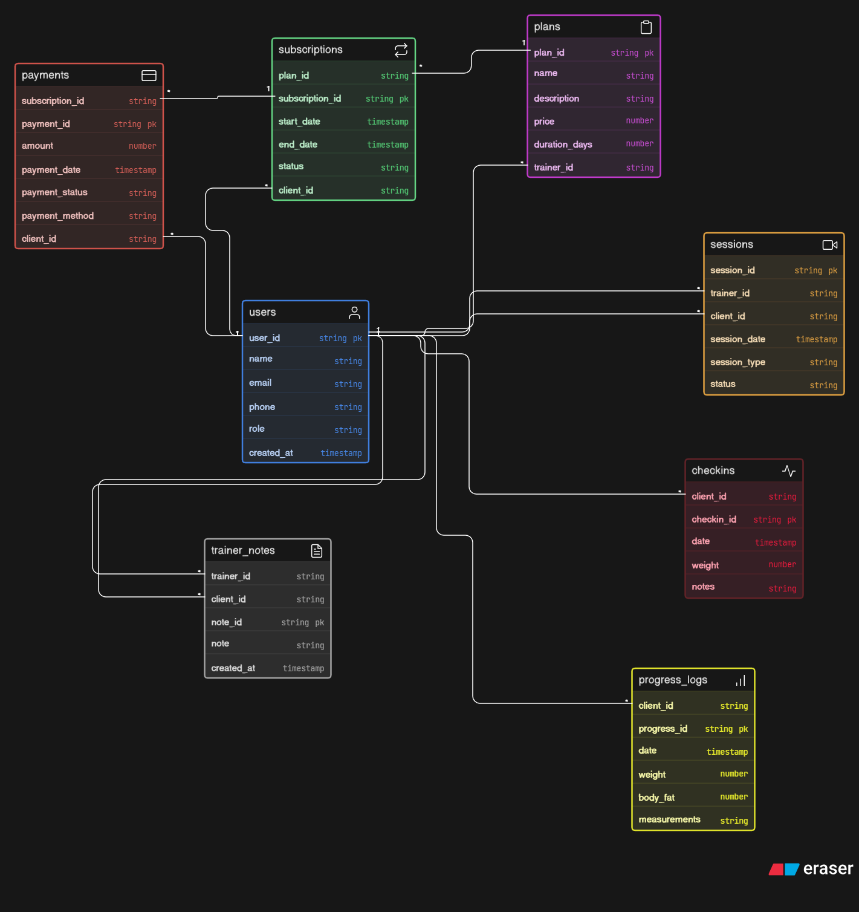

# 🏋️ Fitness Coaching Platform - ER Diagram

## 📌 Overview

This represents the database design for an online fitness coaching platform where trainers manage clients, sell plans, track progress, and schedule sessions.

---

## 🧩 Features Modeled

* Trainer & Client management
* Fitness plans and subscriptions
* Session scheduling (consultation / live sessions)
* Weekly check-ins
* Progress tracking (weight, body fat, measurements)
* Trainer notes & feedback
* Payment tracking

---

## 🗂️ Entities Included

* Users (Trainer / Client)
* Plans
* Subscriptions
* Sessions
* Check-ins
* Progress Logs
* Trainer Notes
* Payments

---

## 🔗 Key Relationships

* A trainer can create multiple plans
* A client can subscribe to multiple plans
* Each subscription links a client to a plan
* Sessions occur between trainer and client
* Payments are linked to subscriptions

---

## 🖼️ ER Diagram

---

## 🚀 Notes

* The design follows normalized structure
* Supports scalability for real-world use
* Separates sessions, check-ins, and progress tracking clearly

---
